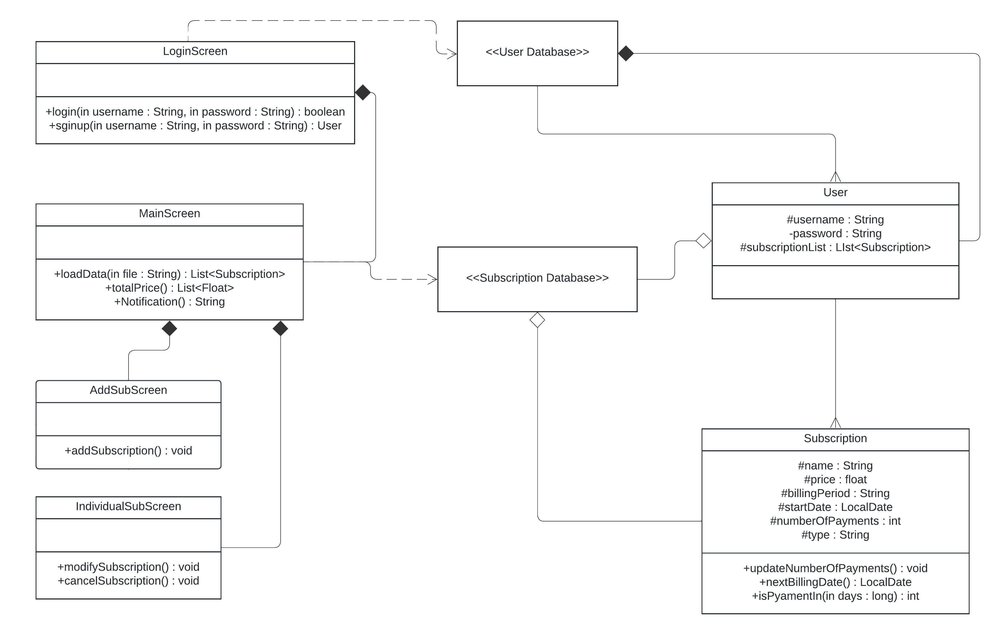

# Sistem pentru gestionarea abonamentelor la diverse servicii
### Student: Tarniceriu Luca

## Descriere

Utilizatorul aplicatiei poate vizualiza si gestiona abonamentele sale pentru mai multe servicii online.
Aplicatia permite adaugarea abonamentelor, caracterizate de nume, pret, data adaugarii, frecventa platii si alte asementea caracteristici. Este posibila actualizarea, anularea si cautarea sau filtrarea abonamentelor dupa diverse criterii.

## Functionalitati

* Sistem de autentificare: fiecare utilizator al aplicatiei poate avea un user diferit, prin intermediul caruia, datele sunt salvate indiviudal
* Sumar al platilor si a preturilor: pot fi vizualizate pretul pe luna si pe an, dar si numarul de subscriptii care urmeaza sa expire
* Adaugarea si modificarea subscriptiilor: este posibila adaugarea unor subscriptii, stergerea lor sau modificarea datelor acestora
* Vizualizarea listei subscriptiilor: in fereastra principala poate fi vizualizata lista cu toate subscriptiile curente.

## Arhitectura

